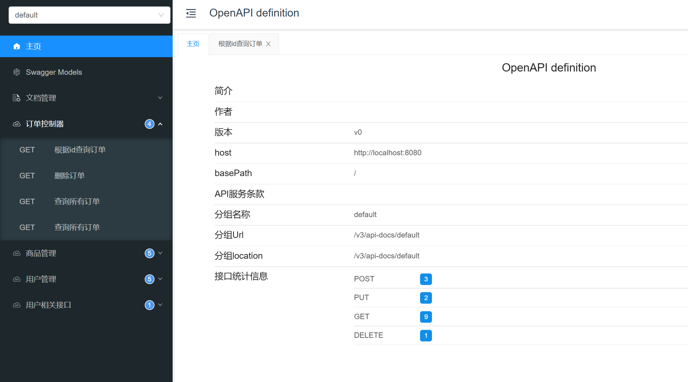

项目介绍：

   准备sql数据库设计，这里我的是边写边做数据库设计不太合理，建议大家看看sql文档即可，具体设计可以在我的基础上改进

swapper技术生成接口文档：

   启动项目后直接访问该地址：http://localhost:8080/doc.html#/home

注意pom.xml文件pagehelpe依赖：因为我需要使用mapper.xml手敲代码（当然也不是所有的都手敲，现在AI技术这么成熟改用还是要用的）所以没有使用mybatisplus技术而是导入pagehelper依赖

这里就是配置了一个自定义的分页工具类供代码使用

